# TCP 传输慢问题分析：窗口、拥塞、SACK 与延迟 ACK

> 来源：CSDN 博主“maimang09”（账号：maimang1001）
>
> CSDN 转载页：https://blog.csdn.net/maimang1001/article/details/120273632
>
> 原始来源：https://zhuanlan.zhihu.com/p/80043707
>
> 许可：CC BY-SA 4.0
>
> 改编说明：本文由转载页面清理为 Markdown，移除了广告、评论和推荐内容，保留了正文诊断思路与配图，并对部分容易误用的结论补充了技术边界。

TCP 传输慢既可能来自网络质量，也可能来自端点协议栈、接收应用、拥塞控制或交互模式。FTP、HTTP 等应用的单连接传输速度，本质上受到 TCP 发送窗口、接收窗口、往返时延和丢包恢复效率的共同限制。

## 阅读与使用边界

- 本文适合构建排查假设，不应仅凭单个 Wireshark 标记直接判定根因。
- 修改拥塞控制、窗口、网卡卸载、Nagle 或延迟 ACK 前，应先通过双端抓包、系统指标和对照实验验证。
- 抓包必须尽量包含三次握手，否则 Wireshark 可能无法获得 Window Scale，窗口相关分析会失真。
- 不同操作系统版本的 sysctl、注册表项和协议栈行为可能变化，执行配置前应查阅当前系统文档并准备回退方案。

## 1. TCP 发送能力的基本约束

TCP 在任一时刻可发送但尚未确认的数据量，主要受两个窗口限制：

- `RWND`：接收方通告的接收窗口，体现接收缓冲区可用空间和应用读取能力。
- `CWND`：发送方的拥塞窗口，体现发送方根据网络反馈估计的安全在途数据量。

发送方可用窗口通常可近似理解为 `min(RWND, CWND)`，但实际吞吐还受到 RTT、应用供数速度、接收端处理速度、丢包、整形和协议开销影响。

### 1.1 在 Wireshark 中观察 RWND

接收方通常在 ACK 中通告窗口。Wireshark 的 `Calculated window size` 会结合 TCP 首部窗口字段与握手阶段协商的 Window Scale 计算实际值。


当有效接收窗口持续偏小，发送方的在途数据会受到限制。窗口字段本身只有 16 bit，Window Scale 选项用于扩大可表达的窗口范围。

### 1.2 CWND、慢启动与拥塞避免

CWND 由发送方协议栈维护，通常无法直接从单侧抓包精确读取，只能结合在途字节数、ACK 时序、发送突发和操作系统指标推断。

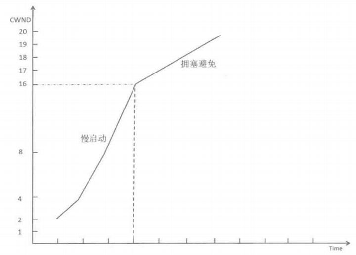

- 连接开始时使用初始拥塞窗口 `initcwnd`。
- 慢启动阶段，CWND 随确认到达快速增长。
- 达到慢启动阈值 `ssthresh` 后进入拥塞避免，增长趋缓。
- 丢包、ECN 或重传超时会触发拥塞响应，具体降窗行为取决于拥塞控制算法。

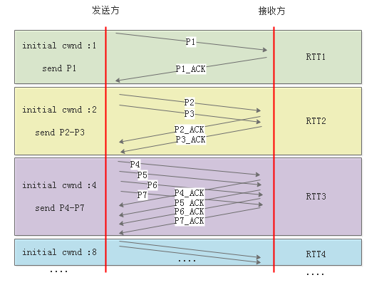

不要只根据“发送不够快”直接调大初始 CWND 或 ssthresh。若路径已经丢包或排队严重，激进增长可能增加重传和时延。

## 2. 网络质量差、丢包和重传

持续丢包会破坏 CWND 增长，并可能触发快速重传或重传超时。相比快速重传，RTO 通常带来更明显的停顿和降窗。

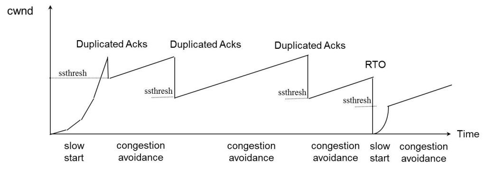

### 2.1 建议的验证顺序

1. 区分原始重传、快速重传、伪重传和抓包点丢包。
2. 检查重传是否集中在特定流、方向、时间段或路径跃点。
3. 对照 RTT、吞吐、在途字节数、Duplicate ACK 和接收窗口变化。
4. 使用双端抓包确认报文是真正在网络中丢失，还是仅未被某一抓包点捕获。
5. 检查接口错误、队列丢弃、限速、QoS、MTU/PMTUD 和中间设备状态。

### 2.2 调整窗口不是首选修复

在已知路径容量较低或强制整形的场景，可通过 pacing、应用限速或拥塞控制算法减少突发。直接降低 RWND/CWND 只能限制发送压力，不能修复物理丢包、接口错误或错误策略。

Linux 路由属性能够针对特定路由设置初始窗口，例如：

```bash
ip route change <route> initcwnd 10
```

命令语法和可用属性依赖系统版本。调整前后必须以同一测试流量复测吞吐、RTT、丢包和重传。

## 3. 带宽时延积与接收窗口

为了让单条 TCP 连接填满路径，窗口至少需要容纳大约一个带宽时延积：

```text
BDP(bytes) = bandwidth(bits/s) * RTT(seconds) / 8
```

例如带宽为 `100 Mbit/s`、RTT 为 `50 ms`：

```text
BDP = 100,000,000 * 0.05 / 8 = 625,000 bytes
```

这只是理论起点。协议开销、拥塞控制、应用处理速度和队列状态仍会影响实际吞吐。不要把 ping RTT 直接视为业务流的精确 RTT，优先使用同一 TCP 流的 ACK 时序或 Wireshark RTT 图表。

Linux 的 `tcp_rmem` 控制接收缓冲区自动调优范围，但它不等同于线上通告的 RWND：

```text
net.ipv4.tcp_rmem = <MIN> <DEFAULT> <MAX>
```

修改缓冲区上限前，应同时检查应用读取速度、系统内存压力、socket 指标以及 `tcp_moderate_rcvbuf` 等自动调优配置。

## 4. CWND 增长偏慢

当网络质量和 RWND 均正常，但在途数据长期不足以覆盖 BDP 时，可以进一步检查 CWND 增长。

常见影响因素包括：

- 拥塞控制算法及其参数。
- 初始拥塞窗口和慢启动阈值。
- ACK 到达节奏与 ACK 压缩。
- 应用没有持续提供数据。
- 发送端 pacing、qdisc、限速或 CPU 调度。
- TSO/GSO/LSO 等卸载导致抓包中看到的分段形态与线上报文不同。

### 4.1 网卡卸载的观察边界

卸载功能可以降低 CPU 开销，通常不应仅为“增加 ACK 数量”而永久关闭。它也可能使主机本地抓包显示超大 TCP 段或与线上分段不一致。

Linux 可用 `ethtool -k <interface>` 查看卸载状态，并在受控实验中临时切换：

```bash
ethtool -K <interface> tso off gso off lro off
```

Windows 中可在网卡高级属性中检查 Large Send Offload 等功能。

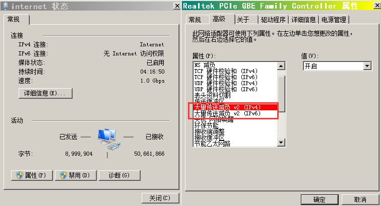

修改卸载配置可能提高 CPU 占用并改变性能结果，实验结束后应恢复原配置。

## 5. SACK 与丢包恢复

SACK（Selective Acknowledgment）允许接收方在累计 ACK 之外报告已经收到的不连续数据块，帮助发送方更准确地识别缺失范围。

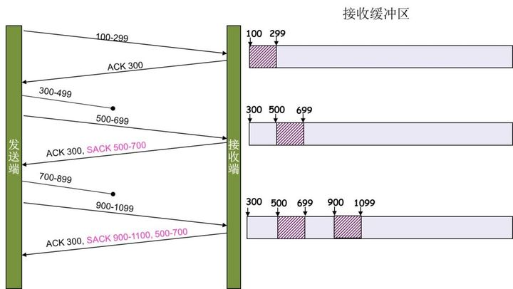

例如累计确认号仍为 300，但 SACK 块表明 500 至 699 已收到，发送方可以判断 300 至 499 仍缺失。实际重传范围由发送方的丢包恢复算法决定；不能简单地认为未启用 SACK 时一定会重传丢失段之后的所有数据。

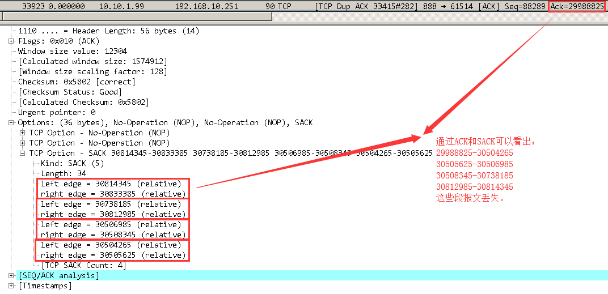

SACK 能力在三次握手的 TCP Options 中协商。双方的 SYN/SYN+ACK 应包含 `SACK Permitted`，后续 ACK 才能使用 SACK 块。

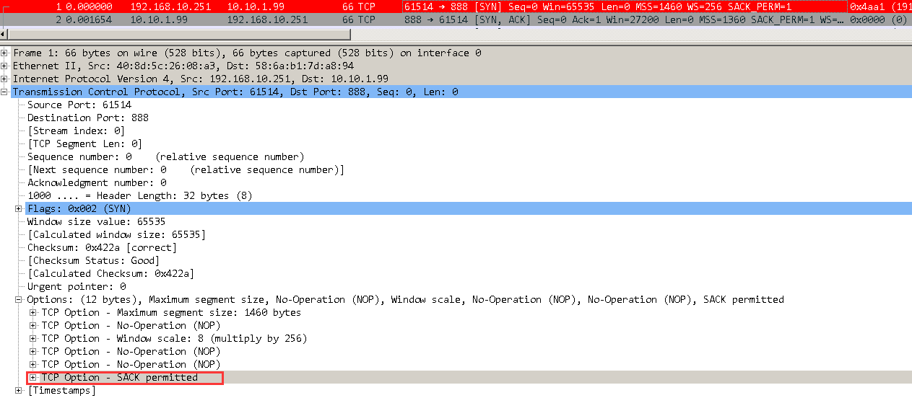

Linux 可检查和启用 SACK：

```bash
sysctl net.ipv4.tcp_sack
sysctl -w net.ipv4.tcp_sack=1
```

若抓包未包含握手，不能仅凭后续没有 SACK 块断言端点不支持 SACK。

## 6. RWND 太小与 Window Scale

Window Scale 在三次握手中协商，每个方向的 scale factor 独立。Wireshark 通常会在 `Calculated window size` 中显示缩放后的窗口。

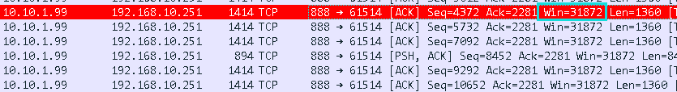

如果抓包缺少握手，Wireshark 无法可靠获知缩放因子，可能显示 `Window size scaling factor: unknown`，由此产生的 `TCP Window Full` 判断也可能不可靠。

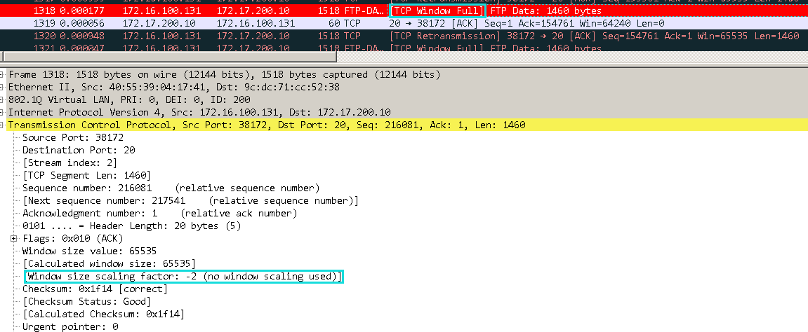

### 6.1 Window Full 与 Zero Window 的区别

- `TCP Window Full` 是 Wireshark 的分析提示，表示发送段到达了分析器推算的接收窗口右边界。它依赖抓包完整性和窗口缩放计算，不是 TCP 报文中的显式标志。
- `TCP Zero Window` 来自接收方通告窗口为 0，表示当前无法继续接收数据。发送方随后通常使用 Zero Window Probe 探测窗口，而不是 keepalive。
- `TCP Window Update` 表示接收方重新通告了更大的窗口。

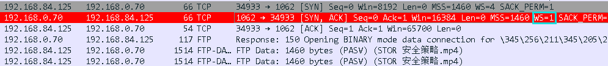

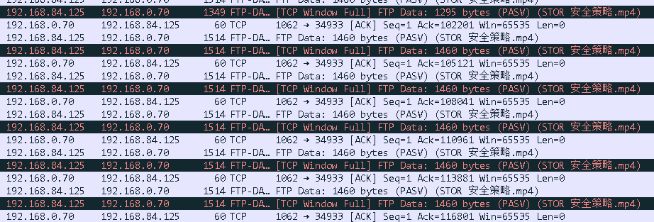

当 RWND 持续很小，应优先检查：

1. 接收应用是否及时读取 socket。
2. 接收端 CPU、磁盘或应用锁是否成为瓶颈。
3. socket 接收缓冲区和系统自动调优是否受限。
4. Window Scale 是否在握手中成功协商。
5. 抓包是否完整，分析器是否正确跟踪了同一条 TCP 流。

Linux 可查看 Window Scale 是否启用：

```bash
sysctl net.ipv4.tcp_window_scaling
```

不建议为了单个案例盲目修改 `tcp_adv_win_scale`。其语义和默认值随内核版本变化，应依据当前内核文档、socket 指标和可复现实验决策。

### 6.2 用窗口和 RTT 估算吞吐上限

若有效窗口约为 `65,535 bytes`、RTT 约为 `0.1 s`，窗口约束下的理论吞吐为：

```text
65,535 / 0.1 = 655,350 bytes/s，约 640 KiB/s
```

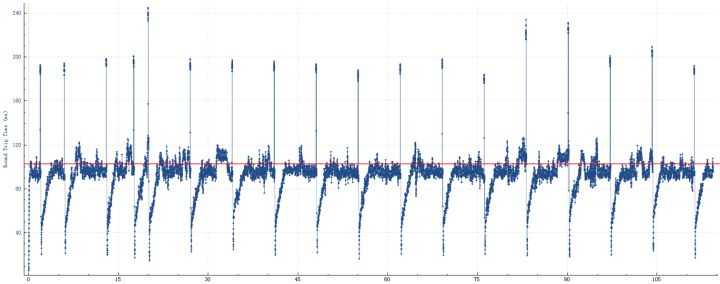

观测吞吐接近该值且窗口持续成为上限时，RWND/Window Scale 是强候选原因；若明显低于该值，还需检查丢包、CWND、应用停顿和限速。

## 7. Nagle 与延迟 ACK

Nagle 算法用于减少未确认的小报文：存在未确认小段时，后续小数据可能被暂存。延迟 ACK 则允许接收方等待后续数据或第二个满尺寸段，以减少纯 ACK 数量。

两者在小请求、小响应或交互式流量中可能形成额外等待，但大文件吞吐慢不能默认归因于 Nagle 与延迟 ACK。

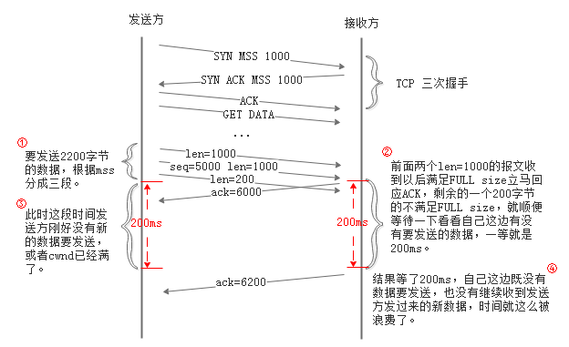

### 7.1 案例中的 200 ms ACK 间隔

案例抓包中，一个较小尾段的 ACK 与前一个 ACK 相隔约 200 ms，发送方在收到该 ACK 后继续发送。该现象与延迟 ACK、发送窗口受限或应用供数节奏有关，需要结合 bytes in flight、RWND、CWND 推断和双端时间线确认。

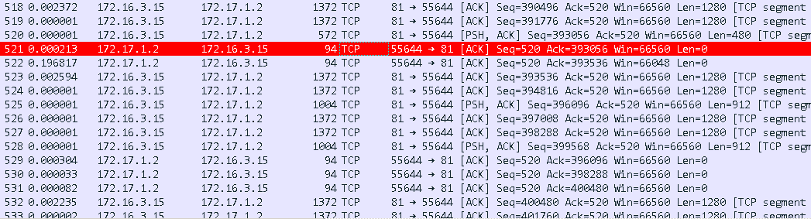

通过 Wireshark TCP Stream Graph 可观察 sequence 随时间的增长；总览可能看似平滑，放大后才能看到周期性停顿。

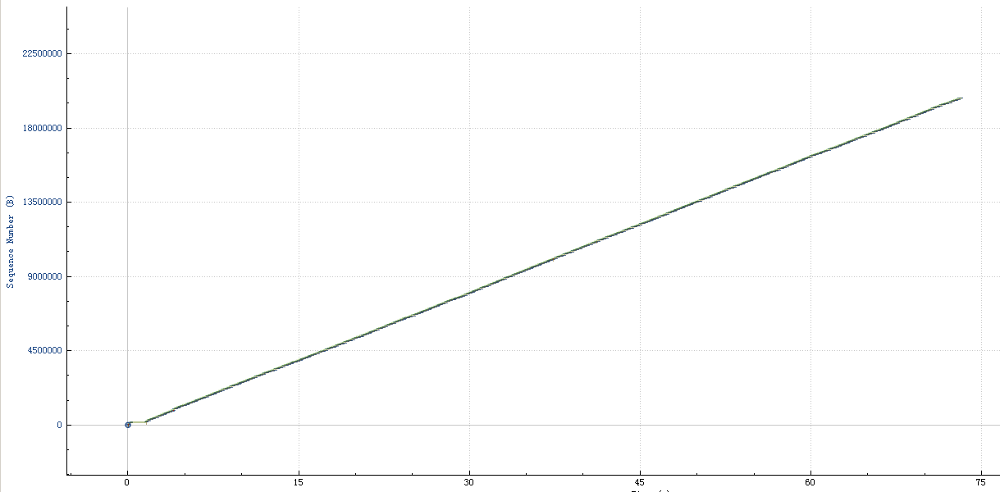

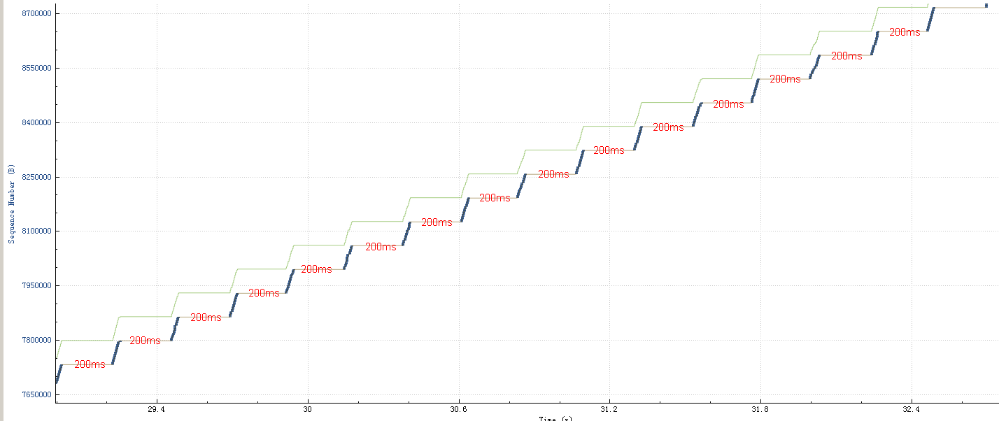

### 7.2 调优原则

- 应用可通过 `TCP_NODELAY` 控制 Nagle；它适合关注交互时延且会产生小写入的场景，不是所有 TCP 流的默认优化。
- Linux `TCP_QUICKACK` 是动态提示，协议栈可能随后恢复正常 ACK 策略，不能当作永久关闭延迟 ACK 的全局开关。
- Windows 注册表调整具有版本和接口范围差异，修改前应依据微软当前文档并记录回退值。
- `tcp_low_latency` 在现代 Linux 内核中可能无效或已被忽略，不能作为通用解决方案。

## 8. 推荐的 TCP 慢速排查流程

1. 明确业务方向、预期带宽、实测吞吐、连接数量和测试持续时间。
2. 获取包含三次握手的双端抓包，并校验抓包丢包和时钟偏差。
3. 计算 BDP，对照 RWND、估算的在途数据量和实际吞吐。
4. 检查重传、Duplicate ACK、RTO、乱序、SACK 和 RTT 变化。
5. 区分接收窗口受限、拥塞窗口受限、应用供数不足和路径限速。
6. 检查端点 CPU、磁盘、socket 缓冲区、网卡错误、卸载和 qdisc。
7. 每次只改变一个参数，保留基线、复测数据和回退方法。

## 9. 结论

TCP 传输速度不是由单一窗口或单一 Wireshark 标记决定。排查时应围绕 `min(RWND, CWND)`、BDP、RTT、丢包恢复和应用读写节奏建立证据链。窗口调优、SACK、卸载设置及 ACK 行为都可能影响性能，但必须结合抓包完整性、系统状态与对照实验判断适用性。
