# 使用 Wireshark 抓包分析 TCP 协议

> 来源：CSDN 博主“大草原的小灰灰”（账号：new9232）
>
> 原文：https://blog.csdn.net/new9232/article/details/124225524
>
> 首次发布：2022-04-17
>
> 许可：[CC BY-SA 4.0](https://creativecommons.org/licenses/by-sa/4.0/)
>
> 改编说明：本文由原网页清理为 Markdown，移除了广告、评论和推荐内容，补充了图片替代文本及协议适用边界。正文和配图沿用原许可。

本文以 Wireshark 抓包截图介绍 TCP/IP 分层、TCP 三次握手、数据传输中的序列号与确认应答，以及连接终止过程。

## 阅读说明

- 截图中显示的 `seq=0`、`ack=1` 等通常是 Wireshark 默认启用“相对序列号”后的结果，并不代表线上 TCP 初始序列号固定为 0。
- TCP 确认号表示接收方下一步期望收到的序列号。SYN 和 FIN 各占用一个序列号空间。
- TCP 连接终止不保证每次都能在抓包中看到四个彼此独立的数据包。ACK 与 FIN 可以合并发送，但协议状态转换仍需结合端点行为判断。
- 本文是入门教程和抓包示例，不替代 RFC 9293 等 TCP 标准，也不应单独作为现网吞吐故障的根因证据。

## 1. 协议分层介绍

Wireshark 的数据包详细信息栏会按协议层次展示各字段。

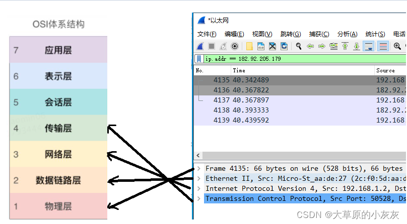

### 1.1 数据链路层

展开数据链路层字段，可以看到当前链路上相邻设备使用的源 MAC 地址和目的 MAC 地址。

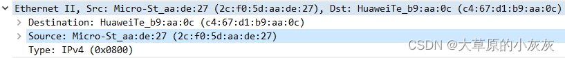

### 1.2 网络层

网络层负责提供源 IP 地址、目的 IP 地址等网络层信息，并承载传输层报文。

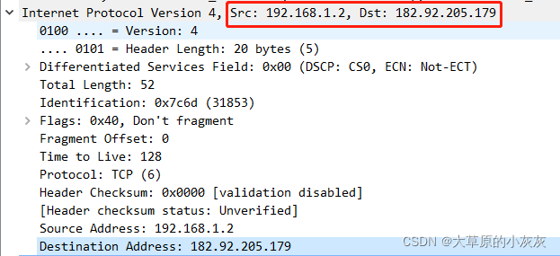

### 1.3 传输层

该示例的传输层使用 TCP 协议。TCP 首部包含源端口、目的端口、序列号、确认号、标志位、窗口等字段。

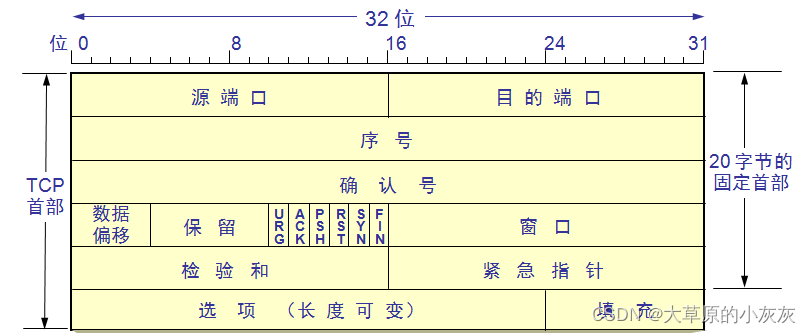

Wireshark 会把捕获到的 TCP 字段解析到对应的首部结构中。

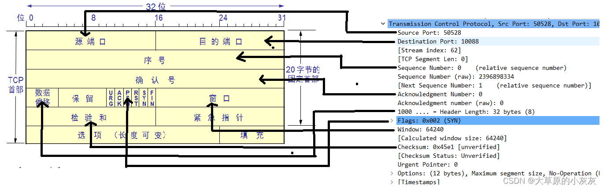

## 2. TCP 三次握手

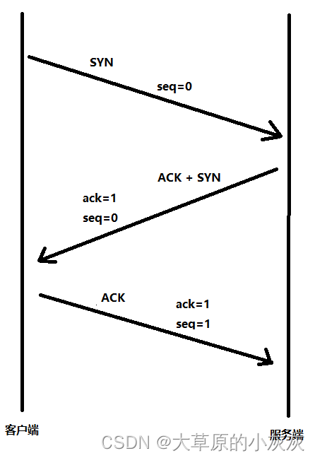

1. 第一次握手：客户端向服务器发送 SYN 段，发起连接请求并携带客户端初始序列号。
2. 第二次握手：服务端返回 SYN+ACK，确认客户端的 SYN，同时携带服务端初始序列号。
3. 第三次握手：客户端返回 ACK，确认服务端的 SYN，连接建立。

原文示例使用 Wireshark 相对序列号显示，因此客户端和服务端的初始序列号都显示为 `seq=0`，对 SYN 的确认显示为 `ack=1`。

### 2.1 Wireshark 握手概览

发起连接后，可以在数据包列表中定位三次握手报文。

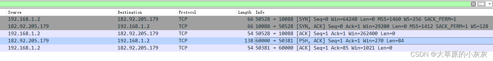

### 2.2 第一次握手：SYN

客户端发起 SYN 请求，Wireshark 的相对初始序列号显示为 0。

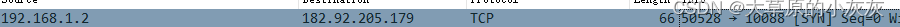

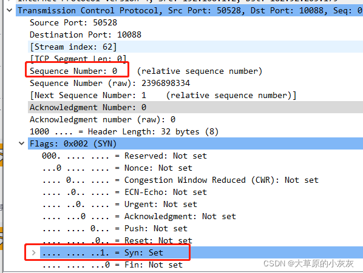

### 2.3 第二次握手：SYN+ACK

服务端返回 SYN+ACK。示例中服务端相对序列号为 `seq=0`，确认号为 `ack=1`。

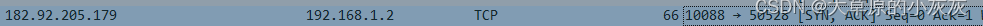

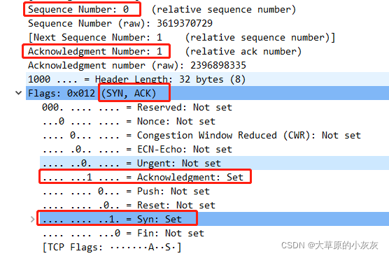

### 2.4 第三次握手：ACK

客户端返回 ACK。示例中相对确认号为 `ack=1`，客户端相对序列号更新为 `seq=1`。至此客户端与服务端建立连接。

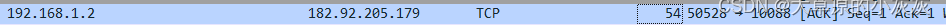

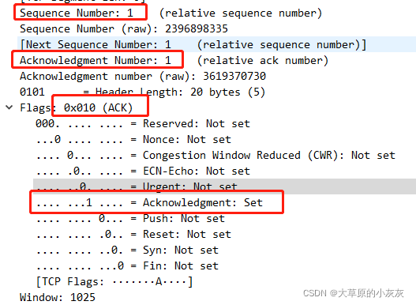

## 3. TCP 数据传输

TCP 使用序列号、确认应答、重传等机制提供可靠的字节流传输。确认号通常表示接收方下一步期望收到的字节序列号。

示例中客户端分两次向服务端发送字符串：第一次发送 `hello`，第二次发送原文所写的 `word`。示意图展示了发送方序列号与接收方确认号之间的关系。

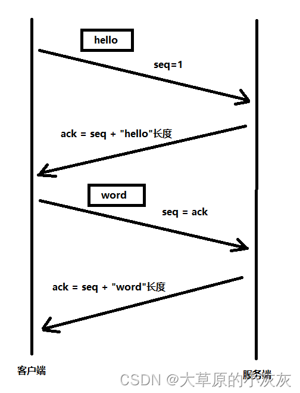

Wireshark 数据包列表中可以看到两次数据发送以及服务端的确认应答。

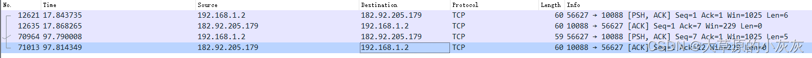

### 3.1 第一次发送

客户端第一次发送字符串 `hello`。原文截图显示该段 TCP 载荷长度为 6 字节，可能包含字符串结束符或其他额外字节，实际应以 TCP payload 长度字段为准。

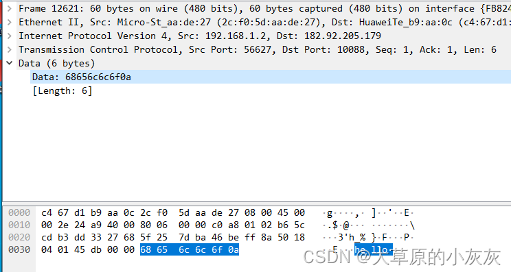

该段的相对序列号为 `seq=1`。

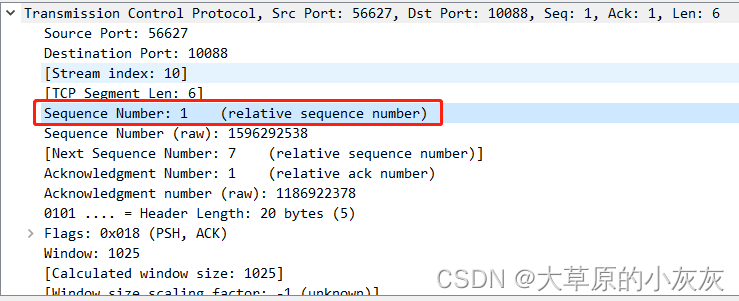

服务端返回 `ack=7`，表示已经确认此前的字节，并期望下一字节从相对序列号 7 开始。

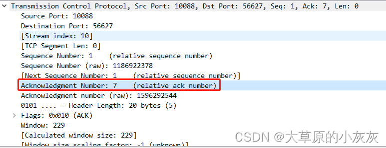

### 3.2 第二次发送

第二次发送字符串 `word` 时，客户端相对序列号使用前一次服务端返回的确认号，即 `seq=7`。

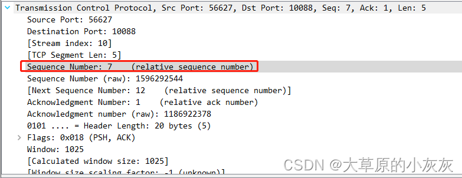

服务端对第二次数据返回的相对确认号为 `ack=12`。

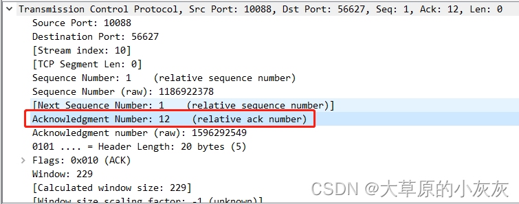

## 4. TCP 连接终止

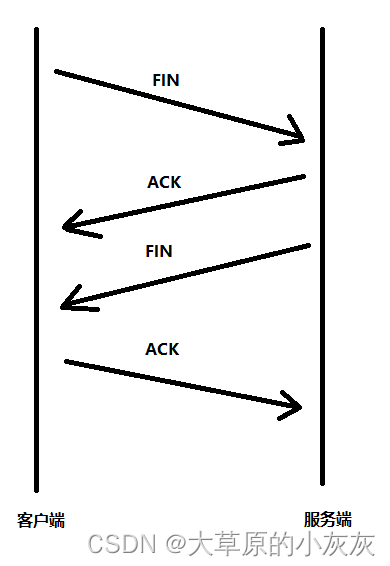

典型的主动关闭过程可表述为：

1. 主动关闭方发送 FIN，表示该方向不再发送数据。
2. 对端返回 ACK，确认收到 FIN。
3. 对端准备关闭其发送方向时发送 FIN。
4. 主动关闭方返回 ACK，确认对端的 FIN。

原文抓包只显示三个报文，因为第二步 ACK 和第三步 FIN 被合并为一个 FIN+ACK 报文。

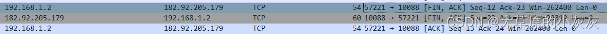

### 4.1 第一次挥手：FIN

客户端发送 FIN 请求。示例使用相对序列号，显示 `seq=12`、`ack=23`；这里的确认号延续此前数据通信状态。

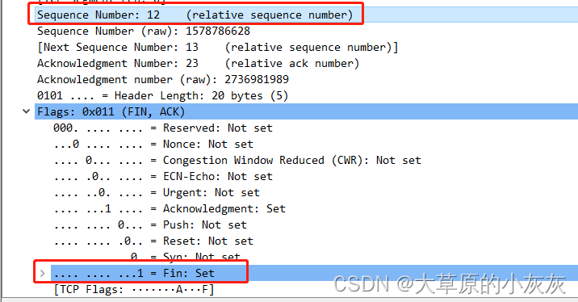

### 4.2 第二、三次挥手：FIN+ACK

服务端用同一个报文发送 ACK 和 FIN，既确认客户端的 FIN，又关闭服务端的发送方向。示例显示 `ack=13`、`seq=23`。

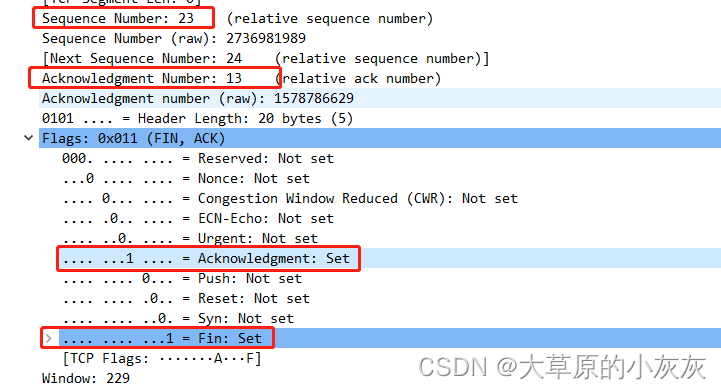

### 4.3 第四次挥手：ACK

客户端返回 ACK，确认服务端的 FIN。示例显示 `ack=24`、`seq=13`。

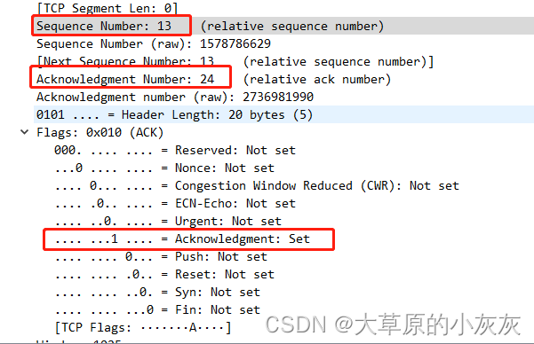

## 参考

- 原文：[使用Wireshark抓包分析TCP协议](https://blog.csdn.net/new9232/article/details/124225524)
- 许可：[Creative Commons Attribution-ShareAlike 4.0 International](https://creativecommons.org/licenses/by-sa/4.0/)
- TCP 标准：[RFC 9293 - Transmission Control Protocol](https://www.rfc-editor.org/rfc/rfc9293)
