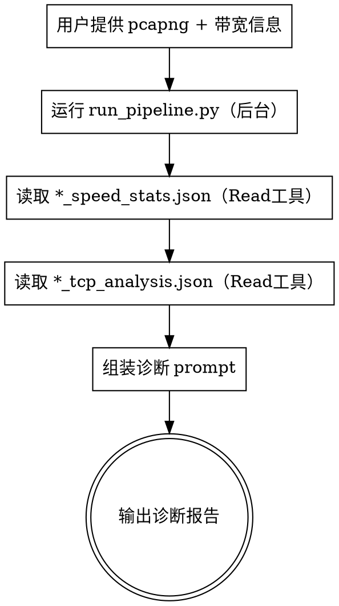

# 测速报文速率不达标原因分析

分析 pcapng 报文中测速流速率不达标的原因，输出带概率的诊断报告。

> **CRITICAL: 全程禁止任何 ad-hoc bash 命令，杜绝放权弹窗。**
> 以下命令形式都会触发安全检测弹窗，**绝对禁止**：
> - `python -c "..."`（无论单行多行）
> - `tshark ... | awk | head`（管道组合命令）
> - `cat /dev/null`、`2>/dev/null` 等涉及 /dev 的命令
> - 任何含换行符或 `#` 注释的 bash 命令
>
> **唯一允许的 bash 命令**：`python <绝对路径>/scripts/run_pipeline.py` 形式 (Step 2)
> **唯一允许的数据读取**：Read 工具读取 JSON 文件 (Step 3/4)
> **诊断阶段**：只从 `*_tcp_analysis.json` 中推理，不要直接跑 tshark/awk

## Skill 文件结构

所有依赖文件均在 skill 目录下，自包含可移植：

```
~/.cac/skills/speed-analyze/
├── SKILL.md                       # 核心：操作手册（必须有）
├── scripts/                       # 自动化脚本
│   ├── run_pipeline.py            # 流水线入口（串联筛选+TCP提取）
│   ├── speed_filter_strip.py      # 测速流筛选+剥离
│   └── tcp_extract.py             # TCP 字段提取+统计计算
└── references/                    # 参考文档
    └── diagnosis-prompt.md        # 诊断 prompt 模板
```

**运行方式**：脚本存放于 skill 目录，但通过**绝对路径**调用，cwd 保持用户当前项目目录不变。所有输出文件（pcapng、JSON、日志）写入项目目录下的 `output/`。

## When to Use

- 用户提供 pcapng 文件路径 + 标准带宽/实际带宽，要求分析速率不达标原因
- 用户提到“测速不达标”、“带宽不够”、“速率低”等关键词
- 用户提供了报文数据，希望诊断网络性能问题

## When NOT to Use

- 用户只是要筛选报文（直接运行 speed_filter_strip.py，设置 --no-strip）
- 用户没有提供带宽信息（无法判断是否达标）

## Process



### Step 1: 收集用户输入

从用户处获取：
- **pcapng 文件路径**（必需）
- **标准带宽**（必需，如 1000 Mbps）
- **实际带宽**（必需，如 300 Mbps）
- **分析方向**（可选，默认 "download"）：用户关心上行还是下载，或两者都分析

如果用户未提供带宽信息，主动询问。

### Step 2: 运行流水线（单次 Bash 后台调用）

使用绝对路径调用 skill 目录中的 `run_pipeline.py`，cwd 保持项目目录不变：

```bash
python ~/.cac/skills/speed-analyze/scripts/run_pipeline.py --input <pcapng路径> --target <download|upload|both> --output output
```

**参数说明**：

| 参数 | 默认值 | 说明 |
|------|--------|------|
| `--input` | 必需 | 输入 pcapng 文件路径 |
| `--target` | `download` | 分析方向：`upload` / `download` / `both` |
| `--output` | `output` | 输出目录 |
| `--max-packets` | `5000` | TCP 提取最大报文数 |
| `--min-ratio` | `0.70` | 单向流量占比阈值 |
| `--min-bytes` | `102400` | 最小流量字节数阈值 |

**执行流程**：

1. **后台启动**：用 Bash `run_in_background` 运行上述命令
2. **等待完成**：收到后台任务完成通知后，确认 exit code 0
3. `run_pipeline.py` 内部自动串联执行：
   - 调用 `speed_filter_strip.py` 筛选测速流
   - 读取 `speed_stats.json` 获取端口信息
   - 对每个方向调用 `tcp_extract.py` 提取 TCP 字段
   - 所有进展实时输出到 stdout（后台运行时自动捕获到日志文件）

**输出文件**：
- `output/{stem}_download.pcapng` / `output/{stem}_upload.pcapng` - 筛选后的测速流报文
- `output/{stem}_speed_stats.json` - 测速流统计摘要
- `output/{stem}_download_tcp_analysis.json` - TCP 分析数据（含逐包字段、会话统计、I/O 时序、Category 6 指标）

### Step 3: 读取 speed_stats.json

> **禁止 `python -c`！** 直接用 Read 工具读取 `output/*_speed_stats.json`，获取测速端口、流数量等信息。

### Step 4: 读取 tcp_analysis.json + 组装诊断 Prompt

> **禁止直接调用 tshark/awk/head！** 所有 TCP 分析数据已在 `*_tcp_analysis.json` 中，用 Read 工具读取后在推理中分析，不要跑任何额外的 bash 命令。

读取文件：
1. `output/*_speed_stats.json` - 测速流统计
2. `output/*_tcp_analysis.json` - TCP 分析数据（computed_stats、syn_options、io_stats_intervals 等）

> tcp_analysis.json 可能较大（含逐包字段），优先读取文件头部的 metadata/syn_options/computed_stats/io_stats_intervals；
> 逐包字段（per_packet_fields）仅在需要深入排查时按 offset 分段读取。

**诊断模板**：模板结构如下，直接参照即可，无需再 Read 任何模板文件：

```json
{
  "standard_bandwidth": "标准带宽 Mbps",
  "actual_bandwidth": "实际带宽 Mbps",
  "achievement_ratio": "达标率%",
  "diagnosis": [
    {
      "cause": "原因名称",
      "probability": "概率%",
      "evidence": "报文数据中的具体证据",
      "affected_flows": ["受影响的流"],
      "suggestion": "排查建议"
    }
  ],
  "summary": "综合诊断结论"
}
```

诊断要求：
- 先逐项排查常见原因（窗口过小、高重传率、高RTT/Bufferbloat、SACK未启用、乱序、MSS过小、TCP选项缺失、拥塞窗口不足）
- 再自由探索非常见原因（NIC丢包、服务端限速、TCP Offload异常、链路层重传等）
- 按概率从高到低排列，数据不足时明确说明

### Step 5: 输出诊断报告

按上述 JSON 格式输出诊断报告。

## Key Principles

- **自包含**：所有脚本和模板均在 skill 目录下，通过绝对路径调用，不依赖项目目录中的文件
- **输出在项目目录**：cwd 保持项目目录，输出文件写入 `output/`，日志也在 `output/log/`
- **先筛选再分析**：不要直接分析原始 pcapng，必须先筛选出测速流
- **不剥离 payload**：默认不启用 `--strip`，保留 tcp.len 用于吞吐量计算
- **单次流水线调用**：Steps 2-3 合并为 `run_pipeline.py`，AI 只需一次 Bash 调用，无需轮询
- **数据驱动**：诊断结论必须有报文数据支撑，不能凭空猜测
- **概率量化**：每个原因必须给出贡献概率，多个原因按概率排序
- **数据不足时诚实说明**：如果报文数据不足以判断某个原因，明确说明而非猜测
- **不限于常见原因**：prompt 模板中的常见原因清单是排查起点，不是全部可能
- **纯 tshark CLI 提取**：`tcp_extract.py` 底层调用 tshark CLI，走 Bash 通道，已配置 permission wildcard (`Bash(python:*)`)，执行过程无需用户手动放权
- **全程零 `python -c`**：禁止 `python -c "..."`（无论单行多行），会触发安全弹窗。读 JSON 用 Read 工具，跑 Python 用 `.py` 脚本
- **禁止诊断阶段跑 tshark/awk**：诊断阶段（Step 4/5）不得运行任何 tshark、awk、head 等命令。所有数据已在 `*_tcp_analysis.json` 中，用 Read 工具读取后推理分析

## Common Mistakes

- 忘记传 --input 参数就直接运行 run_pipeline.py
- 加了 --strip 参数（会剥离 payload，导致 tcp.len=0，吞吐量无法计算）
- **用 `python -c "..."` 解析 JSON（绝对禁止！会触发安全弹窗，必须用 Read 工具或 `.py` 脚本）**
- **诊断阶段跑 `tshark | awk | head`（绝对禁止！所有数据在 tcp_analysis.json 中，用 Read 工具读取）**
- 分别调用 speed_filter_strip.py 和 tcp_extract.py（应使用 run_pipeline.py 一次完成）
- 只看常见原因清单而忽略报文中的其他异常
- 对数据不足的原因给出高概率判断
- 混淆上行和下载方向
